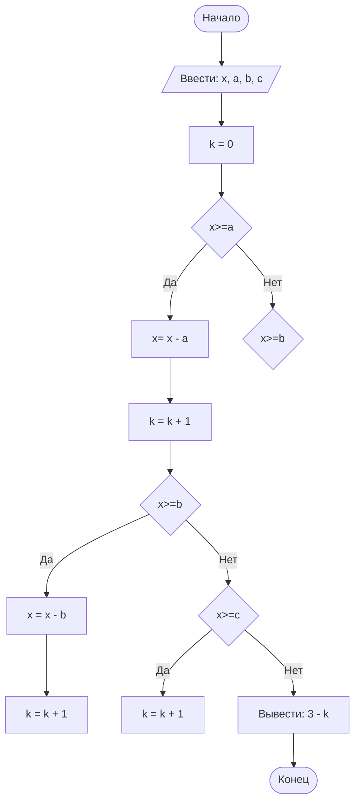

# Отчет по дабораторной работе №1
**№ группы:** ПМ-2401

**Выполнила:** Важова Дарья Юрьевна

**Вариант:** 4

**1.Постановка задачи**

* Условие задачи
>Трое жильцов решили выбросить в контейнер объемом X литров мусорные пакеты объемом A, B, C литров соответственно. Они подходят к контейнеру в указанном порядке и пытаются поместить пакет в контейнер. Если пакет не помещается в контейнер, жилец уносит свой пакет в другое место. Скольким жильцам не удастся выкинуть мусор в указанный контейнер? На вход программы подаются натуральные числа X, A, B, C.
* Моё понимание

Первое число - объем контейнера, следующие три числа - объемы мешков A,B,C соответственно. Перебирая объемы мешков по очереди и уменьшая объём контейнера при попадании туда мешка, понять сколько останется мешков, которые не вошли в контейнер.

**2.Входные и выходные данные**

* Входные данные
  * **Тип данных:** Целые (По условию задачи)
  * **Колличество:** 4 (По условию задачи)
  * **Диапозон:** min = 1, max = 10^9 (На вход могут подаваться только натуральные числа (по условию задачи), наименьшее натуральное число - 1)

* Выходные данные
  * **Тип данных:** Целые (По условию задачи)
  * **Колличество:** 1 (По условию задачи)
  * **Диапозон:** min = 0, max = 3 (Всего жителей дома 3, поэтому если все смогли выкинуть мусор, то невыкинувших 0, а если никто не смог - 3. Остальные случаи лежат в промежутке [0;3])

**3.Выбор структуры данных**

Для хранения введённых значений создадим целочисленные переменные x, a, b, c. Для хранеия информации о числе жильцов, выбросивших мусор, создадим целочисленную переменную k.

**4.Алгоритм**

Описание: на вход подаются 4 целочисленных значения. Создается счетчик людей, которые смогли выкинуть мусор, с начальным значением 0. 

Создаётся условие вхождения пакета А в контейнер. Если пакет А входит, то уменьшается колличество свободного места. Увеличиваем значение счётчика на 1. Создаём условие вхождения пакета B в контейнер. Если пакет B входит, то уменьшается колличество свободного места. Увеличиваем значение счётчика на 1. Создаётся условие вхождения пакета C в контейнер. Если пакет С входит в контейнер, то увеличиваем счётчик на 1.

Если пакет А не входит, то создаём условие для вхождение пакета B. Если B не входит. то создаём условие для вхождения пакета C. 

после выполнения всех действий в условии, вычитаем из общего колличества жильцов колличество жильцов, которые смогли выкинуть мусор. Получаем колличество людей, не выбросивших мусор. Выводим ответ.



**5.Программа**

 ```java
 class Main{
    public static Scanner in = new Scanner(System.in);
    public static PrintStream out = System.out;
    public static void main(String[] args) {
        int x = in.nextInt(); //ввод объема контейнера
        int a = in.nextInt(); //ввод объёма А
        int b = in.nextInt(); //ввод объёма В
        int c = in.nextInt(); //ввод объёма С
        int k = 0; //счётчик людей, сей пакет поместился в контейнер
        //рассмотрим вариант когда A<B<C
        if (x>=a){ //войдет ли пакет А в контейнер?
            x -= a; //место оставшееся после помещения пакета А в контейнер
            k++; //увеличиваем счётчик
            if (x>=b){ //войдет ли пакет B в контейнер?
                x -= b; //место оставшееся после помещения пакета B в контейнер
                k++; //увеличиваем счётчик
                if (x>=c) //войдет ли пакет C в контейнер?
                    k++; //увеличиваем счётчики
            }
            //рассмотрим вариант, когда пакет В не войдёт
            else {
                if (x>=c) //войдет ли пакет C в контейнер?
                    k++; //увеличиваем счётчик
            }
        }
        //рассмотрим вариант, когда пакет A не войдёт
        else{
            if (x>=b){ //войдет ли пакет B в контейнер?
                x -= b; //место оставшееся после помещения пакета B в контейнер
                k++; //увеличиваем счётчик
                if (x>=c) //войдет ли пакет C в контейнер?
                    k++; //увеличиваем счётчик
            }
            //рассмотрим вариант, когда пакеты A и B не войдут
            else {
                if (x>=c) //войдет ли пакет C в контейнер?
                    k++; //увеличиваем счётчик
            }
        }
        out.print(3-k); //найдем сколько человек не смогут выкинуть мусор в контейнер
    }    
 }
 ```
**6.Анализ правильности решения**

